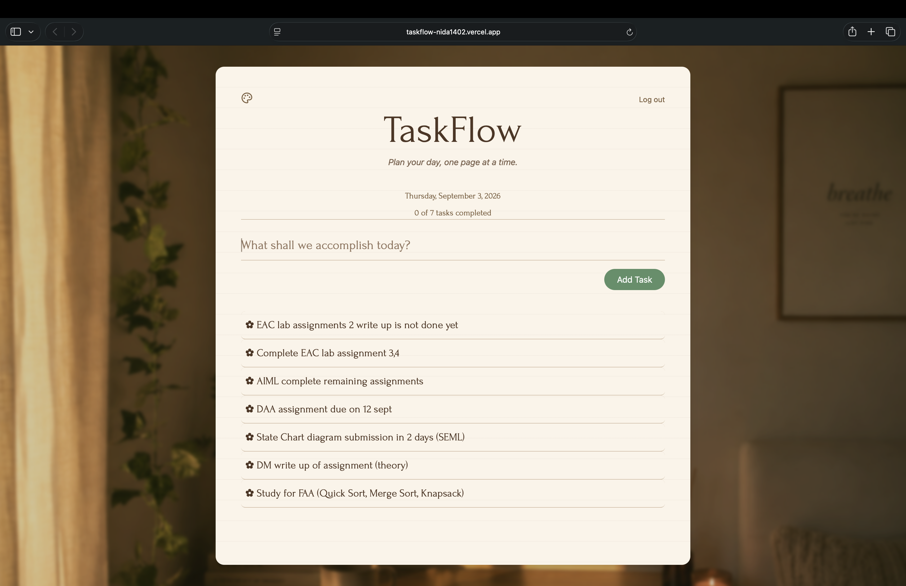

# 📖 TaskFlow

A cozy journal-inspired to-do application built with **React**, **Vite**, **Tailwind CSS**, **Framer Motion**, and **Local Storage**.


## ✨ Features

- ➕ Add tasks
- ✏️ Edit tasks
- ✔️ Mark tasks as completed
- 🗑️ Delete tasks
- 💾 Local Storage support
- 📊 Progress tracker
- 📅 Today's date
- 📖 Empty journal state
- ✨ Smooth animations using Framer Motion
- 🎨 Cozy journal-inspired UI


## 🛠️ Tech Stack

- React
- Vite
- Tailwind CSS
- Framer Motion
- Lucide React
- JavaScript
- HTML
- CSS


## 🚀 Getting Started

1. Clone the repository

```bash
git clone https://github.com/NidaKamil14/TaskFlow.git
```

2. Install dependencies

```bash
npm install
```

3. Start the development server

```bash
npm run dev
```


## 📸 Preview




## 👩‍💻 Author

**Nida Kamil**
