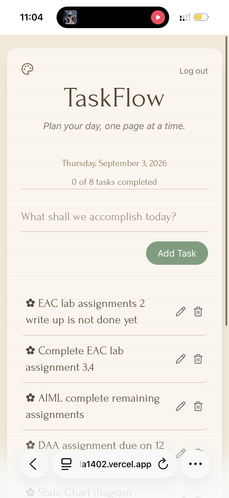

# 📖 TaskFlow

> **Plan your day, one page at a time.** 🌿

TaskFlow is a cozy, journal-inspired task management application designed to make organizing your day feel simple and enjoyable.

Built with **React, Vite, Tailwind CSS, Framer Motion, and Supabase**, TaskFlow combines everyday productivity features with a warm, minimal journal-style interface.

## ✨ Features

- ➕ Add new tasks
- ✏️ Edit existing tasks
- ✔️ Mark tasks as completed
- 🗑️ Delete tasks
- 🔐 User authentication with Supabase
- 💾 Persistent task data
- 📊 Visual progress tracker
- 📅 Today's date display
- 📖 Empty journal state
- ✨ Smooth animations with Framer Motion
- 🎨 Cozy journal-inspired UI
- 📱 Responsive design

## 🛠️ Tech Stack

- **React** — UI development
- **Vite** — Development and build tool
- **Tailwind CSS** — Styling
- **Framer Motion** — Animations
- **Supabase** — Authentication and database
- **Lucide React** — Icons
- **JavaScript**
- **HTML**
- **CSS**

## 🚀 Getting Started

### 1. Clone the repository

```bash
git clone https://github.com/NidaKamil14/TaskFlow.git
```

2. Clone the repository

```bash
cd TaskFlow
```

3. Install dependencies

```bash
npm install
```

4. Set up environment variables

```bash
VITE_SUPABASE_URL=your_supabase_url
VITE_SUPABASE_PUBLISHABLE_KEY=your_supabase_publishable_key
```

5. Start the development server

```bash
npm run dev
```

## 📸 Preview

### Desktop


### Mobile



## 🌐 Live Demo

TaskFlow — https://taskflow-nida1402.vercel.app

## 👩‍💻 Author

**Nida Kamil**
